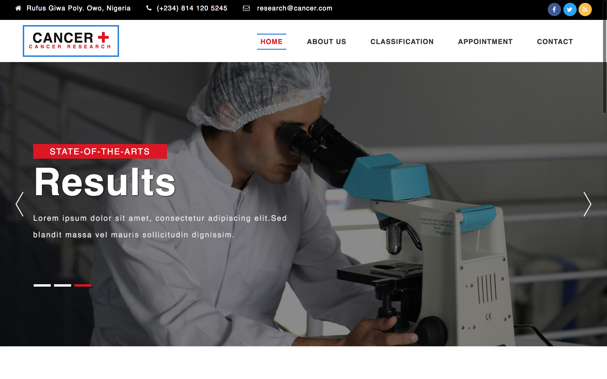

# cancer-research
A breast cancer research project



## Table of contents

- [Dependencies](#dependecies)
- [Setup](#setup)
- [Contribution](#contribution)
 
## Dependencies

- [Flask](http://flask.pocoo.org/) – ```pip install flask```
- [Numpy](http://www.numpy.org/) – ```pip install numpy```
- [Pandas](https://pandas.pydata.org/) – ```pip install pandas```

## Setup

```
$ pip install --upgrade pip
```

Then you probably want to work from your local PC:

Start by cloning the project from github:
```
$ cd ~/Documents/
$ git clone https://github.com/victor-iyiola/cancer-research.git
$ cd cancer-research
``` 

or:

You can download the `.zip` project files [here](https://github.com/victor-iyiola/cancer-research) and extract the 
project files.

```
$ cd <your_download_dir>
$ cd cancer-research
```

Then install these requirements:
```
$ pip install --upgrade -r requirements.txt
```
     
Finally, start the project:
```
$ python __init__.py
```

## Contribution

This project is opened under [MIT 2.0 license](https://github.com/victor-iyiola/cancer-research/blob/master/LICENSE).